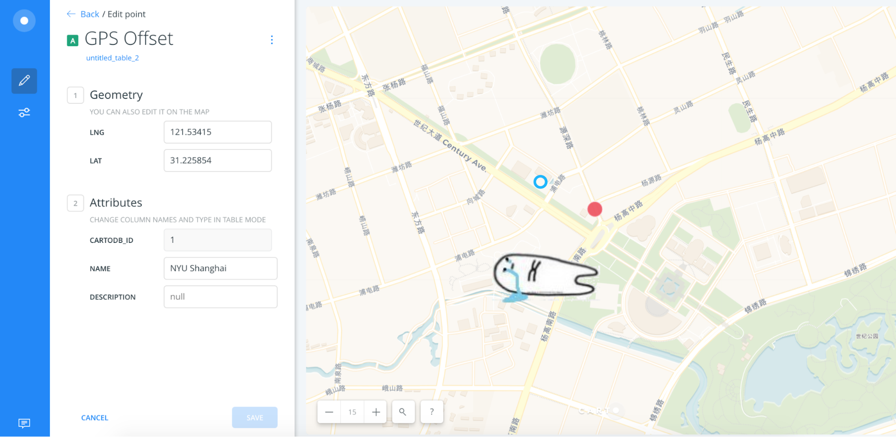

# HTML Template

Follow the steps below to use this template to build a visual narrative.

1.  Click the green "Clone or Download" button, and then "Download ZIP".
1.  Unzip the downloaded file and open the `index.html` file in a text editor
1.  Replace the text and media with your own content.
1.  Optionally use the built-in CSS classes (`.left`, `.center` and `.right`) to position your media. You can find examples of how to do this in the `index.html` file.

The template was created by Chuyi Zhang and Zijin Gao at NYU Shanghai's IMA program.

# Map Template

The guide below shows how to create a map of Shanghai with your own data on Carto, as demonstrated in [this Carto map](https://jd3036.carto.com/builder/699904d2-7ae0-4be9-84c3-2f2e370fc263/embed).

## Getting Started

### Dashboard

The dashboard is the place user can access their online map files on Carto’s website. You may open your previous work or create a new map in the dashboard.

