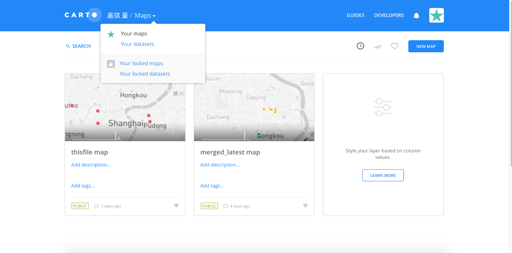
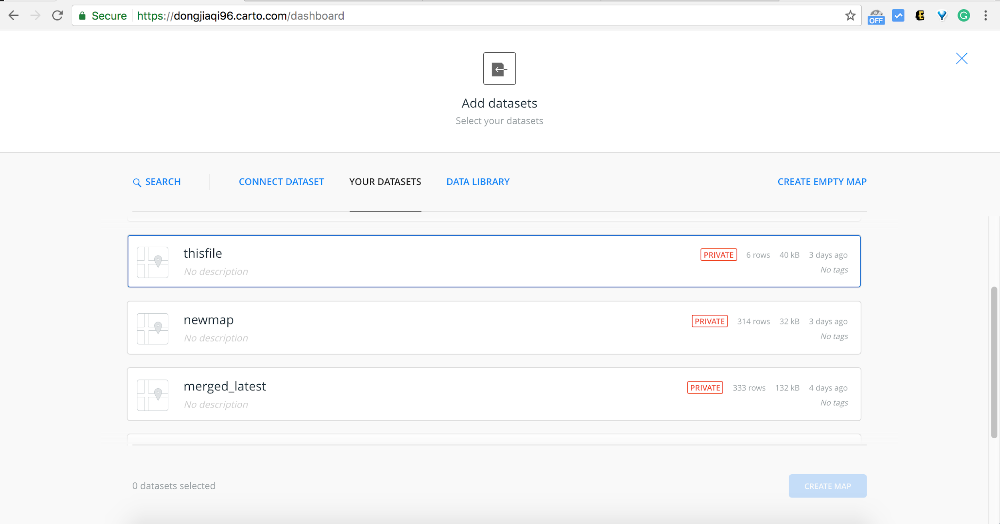
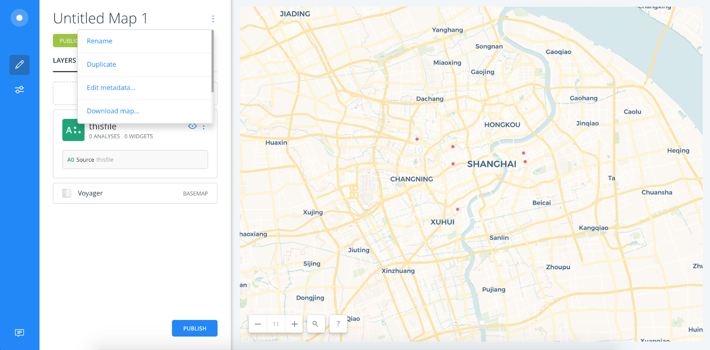
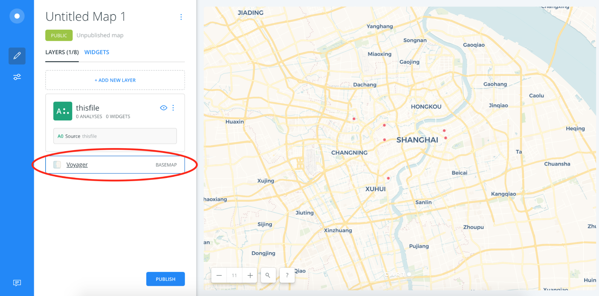
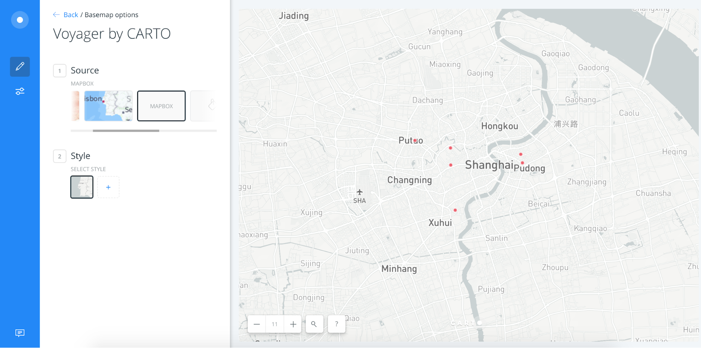

# HTML Template

Follow the steps below to use this template to build a visual narrative.

1.  Click the green "Clone or Download" button, and then "Download ZIP".
1.  Unzip the downloaded file and open the `index.html` file in a text editor
1.  Replace the text and media with your own content.
1.  Optionally use the built-in CSS classes (`.left`, `.center` and `.right`) to position your media. You can find examples of how to do this in the `index.html` file.

The template was created by Chuyi Zhang and Zijin Gao at NYU Shanghai's IMA program.

# Map Template

The guide below shows how to create a map of Shanghai with your own data on Carto, as demonstrated in [this Carto map](https://jd3036.carto.com/builder/699904d2-7ae0-4be9-84c3-2f2e370fc263/embed).

## Getting Started

### Dashboard

The dashboard is the place user can access their online map files on Carto’s website. You may open your previous work or create a new map in the dashboard.

### Creating a map

If you have a Carto map file (xx.carto), you can simply drag and drop the file to this dashboard to upload it. To create a new map file, click the button “NEW MAP” on the top-right corner. Then it will lead you to the dataset page. On this page, you may see the existing datasets or you may drag and drop a CSV, XLS, ZIP, KML, GPX file here to upload your dataset. Here, we use the existing dataset “thisFile” to create the map (select it and click on the button in bottom-right corner “CREATE MAP”).

### Basic Map Functionality

This is the initial presence of the newly created map (if there’s GPS coordinates information in the dataset). When clicking on the “more options” (aka. The three dots) next to the map name, there’s a menu where you may edit/delete/download the map. It is highly recommended to download your xx.carto map file as a backup because all your edits on the css and html will be saved in the xx.carto file along with the data.

To change the basemap, you may click the “BASEMAP” bar to browse more options. For example, in this case we choose Mapbox basemap for the project.

