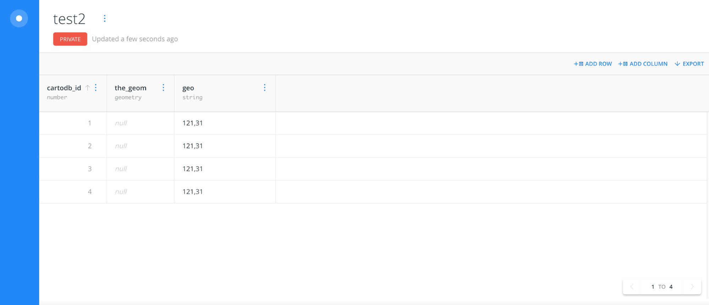

# HTML Template

Follow the steps below to customize the HTML template in this repository. [This link](http://assets.runemadsen.com/shanghai/index.html) shows an online version of the template.

1.  Click the green "Clone or Download" button, and then "Download ZIP".
1.  Unzip the downloaded file and open the `index.html` file in a text editor
1.  Replace the text and media with your own content.
1.  Optionally use the built-in CSS classes (`.left`, `.center` and `.right`) to position your media. You can find examples of how to do this in the `index.html` file.

The template was created by Chuyi Zhang and Zijin Gao at NYU Shanghai's IMA program.

# Map Template

The guide below shows how to create a map of Shanghai with Carto using your own data. [This Carto map](https://jd3036.carto.com/builder/699904d2-7ae0-4be9-84c3-2f2e370fc263/embed) shows the final result.

## Getting Started

### Dashboard

The dashboard is the place to acces all online map files under an account . You may open your previous work or create a new map in the dashboard.


### Creating a map

If you have a Carto map file (`.carto`), you can simply drag and drop the file to this dashboard to upload it. To create a new map file, click the “NEW MAP” button in the top-right corner. This will lead you to the dataset page. On this page, you see your existing datasets, or you may drag and drop a `.csv`, `.xls`, `.zip`, `.kml` or `.gpx` file here to upload your dataset. Here, we use the existing dataset “thisFile” to create the map (select it and click on the “CREATE MAP” button in bottom-right corner).


### Map Functionality

#### Basic Functions

If the dataset has GPS coordinates, it will look like the following screenshot. If you click the “More options” button (the three dots) next to the map name, there’s a menu where you may edit/delete/download the map. It is highly recommended to download your `.carto` map file as a backup as you go along. All your edits to the CSS and HTML code will be saved in the `.carto` file along with the data.


#### Changing Basemap

You can click the “BASEMAP” bar to browse more options for basemaps. In this case, we are using the Mapbox basemap.


#### Editing data points

The individual data points can be edited directly in the map interface. When you move the cursor to the data point, click the pen icon.


Click the pen icon, you will find the attributes and be able to edit them accordingly.


#### Visualization style

First, we need to enter the data point layer, by clicking on the layer. Also, you may make it invisible if you click on the eye icon.


When you enter the layer, there are five options. In this documentation, we will look into the “STYLE”, “DATA” and “POP-UP” for the fundamentals.

A. The “STYLE” option is for changing the style (color, shape, stroke, blending and etc.).


B. The “DATA” option will analyze the dataset and enable you to add widgets on the map for the analysis. Users can interact with the widget and filter the information (e.g. selecting specific year or range of year, showing the data points in the specific district).


C. “POP-UP” is to create the information window for each data point. The type of information could be text, sound, audio and video. The style of the pop-up is can be edited in HTML mode.


Since the pop-up is in HTML, it makes it possible for us to embed media files in addition to pure text in the pop-up window. If you have the URLs for your media files, you can embed them with HTML in the map. We will introduce how to format the data entries in the next section in 2.4.

### Dataset

You may access the dataset through the dashboard.


Or use the toggle in the bottom-right corner of the map.


#### Data type

The data types include: geometry data, number, string, date and boolean. The data type will affect the data analysis (e.g. if you set numbers as strings, the “DATA” option will not be able to recognize it and generate the column chart). You may edit the entries by double clicking the cell.


#### GPS data

GPS data is mandatory for visualizing each data point on the map. It follows the format of:

```json
{ "type": "Point", "coordinates": [longitude, latitude] }
```


_When you upload the original data file to your dataset in Carto, if there are columns of “latitude” and “longitude” in the file, Carto will automatically convert it into the geometry data type._


BUT, it will not work if you put it in the original file as “121.23, 31.25” since Carto will take this as a string.



Notice: Since there’s always offset of GPS location in China, it is highly recommended to double check the exact location on the map. The easiest solution to fix it in Carto is to edit the GPS coordinates by hand to make it in the correct place.


#### Media file data

As we mentioned before, you can write HTML directly in the data point's pop-up window. This is the HTML required for different media types:

**Image:** ``. _Check the [HTMl img tag reference](https://www.w3schools.com/tags/tag_img.asp)_


**Video:** `<VIDEO SRC="url_of_video_file" CONTROLS type="video/mp4" ALT="video not available" WIDTH=165 HEIGHT=165>`. _Please make sure you change the “type” accordingly. If your url goes to a .ogg file, you need change the type="video/ogg". Check the [HTMl video tag reference](https://www.w3schools.com/tags/tag_video.asp)_


**Audio:** `<AUDIO SRC="url_of_audio_file" CONTROLS type="audio/mpeg" ALT="audio not available">`. _Check the [HTMl audio tag reference](https://www.w3schools.com/tags/tag_audio.asp)_


If you don't have a file server, you can upload your files via Google Drive and use them in Carto like this:

1.  Set the file as public on the web
1.  Get the URL of the shared file:
    (e.g. `https://drive.google.com/file/d/1ssjOehZzBBY5-jVqj860pP8_MWnYKh7A/view?usp=sharing`)
1.  Edit it into the following structure: `https://drive.google.com/uc?export=view&id=1ssjOehZzBBY5-jVqj860pP8_MWnYKh7A`
1.  Embed the link into the data as show above.

This guide was written by Jiaqi Dong at NYU Shanghai's IMA program.
